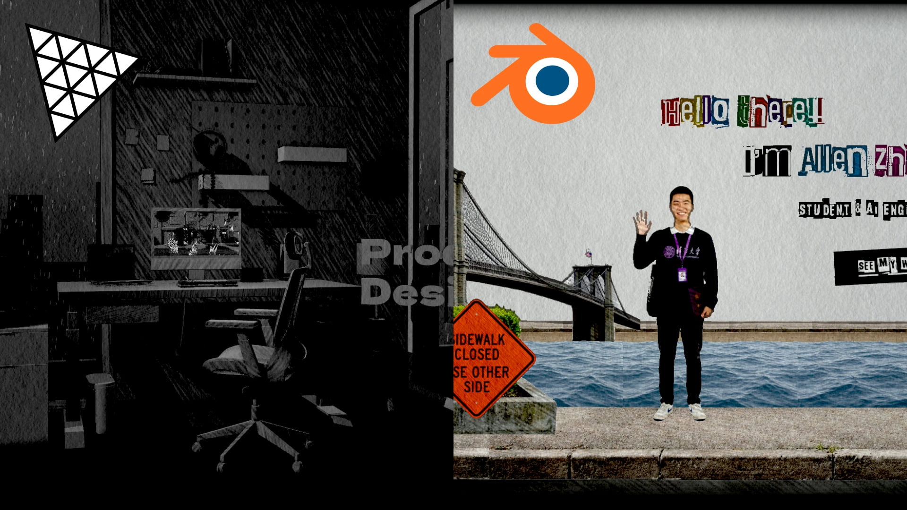

# Hatch & Outline Lab



> **A** and **B** were extracted from two demo sites using these techniques —
> **A** from
> [Katsumi Watanabe's Portfolio](https://katsumi-watanabe-folio.vercel.app/) (left
> above), **B** from
> [Allen Zhang's Portfolio](https://allen-zhang-folio.vercel.app/) (right).
> **C** is a port of a Blender sketch-shader node group; **D** reimplements
> Blender's Grease Pencil Line Art in real time.

Four ways to make a three.js scene look hand-drawn — crosshatched shading, ink
outlines, and a stop-motion "boil" — running side by side on the same objects,
the same lights, and the same paper grade, so the only thing that differs is the
technique.

The panes are arranged so that **each neighbouring pair changes exactly one
thing**: B and C share an outline and differ only in the hatching; C and D share
the hatching and differ only in the outline.

Everything is [three.js](https://threejs.org) **WebGPU + TSL**, and the app loads
no binary assets at all: every crosshatch sheet, mark style and sheet of paper is
generated on a canvas at startup.

There is a plain-English explainer of all four at
[`about.html`](about.html), linked from the demo itself.

```bash
npm install
npm run dev
```

Prefers WebGPU (Chrome/Edge 113+, Firefox 141+, Safari 26+) and falls back to a
WebGL2 backend on its own where WebGPU is unavailable — including over plain HTTP
on a LAN address, where `navigator.gpu` is undefined regardless of browser
support because it is `[SecureContext]`.

Controls live in the **three.js Inspector's "Parameters" tab**, not a standalone
panel. The Inspector belongs to a renderer and there are four here, so the first
pane built hosts the one panel and the rest draw into its group.

A transform gizmo on the key light sits in the first pane; drag it to move the
light and **every** scene relights together. Switch it between the light and its
target under `Light (all panes)`, along with intensity, colour and the helpers.
Only one gizmo exists on purpose — two would be two things claiming to be the
truth, with a sync loop to arbitrate between them.

Drag any pane to orbit, right-drag to pan, scroll to zoom — all four cameras are
locked together, so whichever pane you grab, they all move. Orbiting is the
fastest way to see where the methods diverge: watch A's and D's outlines hold
rock steady while B's and C's swim a little, and watch B keep drawing the torus
knot's interior contours from angles where A shows only its silhouette.

**On a phone** the layout collapses to one pane at a time, chosen with `?pane=a`
… `?pane=d` and a switcher along the bottom. Four renderers, each with its own
device and post chain, is not something a phone can afford — so the comparison
becomes sequential rather than simultaneous.

---

## The four methods

| | **A — Inverted Hull** | **B — Screen-Space Line Art** | **C — Sketch Shader** | **D — Object-Space Line Art** |
| --- | --- | --- | --- | --- |
| **Hatching** | Sheet multiplied in through a shadow mask | Sheet read as four tone stops: white → R → G → B | Threshold map: strokes appear in rank order | Same as C, unchanged |
| **Marks stick to** | Mesh UVs | Mesh UVs | The screen | The screen |
| **Tone comes from** | An authored light direction | An authored light direction | The real lit result (`Shader to RGB`) | Same as C |
| **Hatch boil** | Cycle which channel is sampled | Walk the sampling UV one golden angle per step | Offset the whole sheet per stop-motion tick | Same as C |
| **Outline** | Backface-expanded duplicate geometry | Edge detection over a depth/normal/id pre-pass | Same as B, unchanged | Contours read from mesh topology, chained into strokes |
| **Interior contours** | No — a hull is only ever a silhouette | Yes | Yes | Yes |
| **Line width** | Object-space, varies with distance | Uniform in pixels | Uniform in pixels | Uniform in pixels |
| **Gaps along the line** | — | A screen-space field that happens to cross it | Same as B | Exact — measured along the stroke's own length |
| **Cost grows with** | Mesh count | Screen size | Screen size | **Model detail** (a CPU solve) |
| **Steadiness** | Rock steady under camera motion | Swims slightly | Swims slightly | Rock steady |

None of them is "the right one". A has almost no infrastructure and composites
with anything; B inks a whole scene with no per-mesh setup and can modulate the
line per pixel; C puts the marks on the paper rather than on the model and gets
cast shadows as hatching for free; D is the only one that knows a contour is a
*curve*, which is what lets it place gaps along a stroke rather than approximate
them. Look at the torus knot across the panes: A draws only its outside, the
other three draw where the tube passes in front of itself.

**B is the sensible default.** Reach for A when lines must never swim, C when the
marks should read as being on a page, and D when the breaks in the line are the
point.

### The one idea every boil shares

```js
const step = time.mul(speed).floor();
```

The clock runs continuously; `floor()` makes the drawing change only on integer
ticks and **hold** in between. That hold is what separates a hand-drawn boil from
a smooth animated wobble, and every noise in this repo is seeded on it — method
D runs the same idea on the CPU, since its strokes are built in JavaScript.

Method D is also the one place where that clock has to be kept apart from
another. Its contour geometry is view-dependent and must be re-solved often, or
the outline detaches from a spinning object; its *hand* redraws a few times a
second like everything else. Two clocks, `solve rate` and `boil`, and conflating
them turns the lifts into noise rather than a boil.

### Drawn cast shadows

Methods A and B shade a surface by its own angle to the light. That is why a flat
floor never hatches — its normal does not change just because something is
standing on it — and it is why cast shadows in most stylised renderers come out
as a **flat grey patch laid over the drawing**. The shadow arrives separately, as
a light attenuation the renderer multiplies in *after* `colorNode`, so by default
it can only dim what is already there.

An illustrator does not do that. A cast shadow is *drawn*, with the same strokes
as everything else — so here it samples the **same crosshatch sheet the surfaces
use**, boiling on the same beat.

`material.receivedShadowNode` is the hook, but it is **not** the place to do the
work:

```js
// The trap: a texture() fetch in here resolves to a CONSTANT, whatever UV or
// explicit mip level you hand it. Every knob still appears to respond, because
// the constant scales with them — so you get a flat patch with extra steps.
material.receivedShadowNode = Fn(([shadow]) => mix(hatchFromSheet, float(1), shadow));
```

Plain arithmetic on `uv()` / `screenUV` *does* vary per fragment in there, which
makes the failure genuinely hard to spot. Only the fetch is broken.

The way around it is to use the hook purely to **capture** the shadow and apply
the darkening yourself, in the ordinary fragment body where sampling behaves:

```js
const shadowFactor = float(1).toVar();

material.receivedShadowNode = Fn(([shadow]) => {
  shadowFactor.mulAssign(shadow); // mulAssign: several lights must compound
  return float(1.0);              // bypass the built-in multiply
});

material.outputNode = vec4(output.rgb.mul(shadowTint), output.a);
```

One consequence worth knowing: the built-in multiply only attenuates the light's
own contribution, whereas this multiplies the finished pixel, ambient included.
That is closer to what ink does to paper, but `depth` needs a different value
than a stock shadow would.

Each method then does it in its own idiom — A darkens by its boiled greyscale
sheet, B reads the sheet's denser G/B stops — and both expose `cast shadow:
drawn`. Drag it 0 → 1 to watch a flat patch turn into hatching.

#### Contact, and an edge that isn't a contour

Two things separate a drawn shadow from a rendered silhouette, and both need to
know **how deep into the shadow** a fragment sits:

- **Directional falloff.** The one that actually reads as drawing. A shadow is
  heaviest where it meets the object and thins as it runs AWAY from the light —
  a gradient along the ground, not a rim. `light falloff: start` / `length` set
  it, in **world units**, measured along the light direction flattened onto the
  ground:

  ```js
  const toLight = normalize(lightDirectionWorld);        // surface → light
  const flat = vec3(toLight.x, 0, toLight.z);
  const cast = flat.div(max(length(flat), 1e-4)).negate(); // the way it is thrown
  const along = dot(positionWorld.sub(anchor), cast);
  ```

  The length guard is not paranoia: a light straight overhead flattens to a zero
  vector, and normalising that is a NaN that blackens the frame.

  `anchor` tracks the light's **target**, so dragging the target gizmo drags the
  point shadows fade away from. Note the limitation — it is one global anchor,
  not per-caster, so an object further downwind gets a more faded shadow overall.
  Anchoring per-object would need the occluder's distance out of the shadow map,
  which three does not expose.

- **Contact.** A shadow is heaviest under and beside the object and lightens as
  it runs away. `cast shadow: fade start` / `fade end` set where on the falloff
  field the shadow begins and where it reaches full strength: widen the gap and
  more of the shadow is transition, close it up and you get a hard edge.

  Two traps here. Reshaping the field with a `pow()` curve does almost nothing,
  because the field is already 1 across the whole interior — `1^n` is still 1, so
  you are only bending a thin rim. And widening the penumbra alone does not fix
  that: `shadow.radius` is in **shadow-map texels**, so its worth in world units
  is `radius * frustumWidth / mapSize` — at 1024 over a 12-unit frustum that is
  0.012 units per texel, and even radius 8 is a hairline on a two-unit shadow.
  Halving the map buys penumbra far more cheaply than raising the radius.

  Then VSM light-bleeds as its blur grows: past a modest radius the shadow does
  not spread, it *evaporates*, because the core stops reaching full darkness. The
  `fade start`/`fade end` remap stretches the usable part of the field back over
  the full range, which is what turns the fade's spatial width into a control
  instead of a side effect. `Shadow spread (all panes)` drives the radius live.
- **A ragged edge.** A clean boundary gives the whole thing away. A noise pushes
  the field around *before* the curve (`edge break-up`, `edge scale`), so the edge
  breaks up — and because the noise moves the FIELD rather than the finished
  colour, strokes near the edge thin and drop out one by one, the way a pencil
  lifts.

  Two details make the difference between "broken edge" and "churning mess".
  Weight the noise by `depth * (1 - depth)`, which peaks halfway through the
  falloff and is zero at both ends, so it only touches the transition band — apply
  it across the whole field and the shading crawls over the entire shadow. And
  scale the boil axis *down* when feeding the stop-motion clock into the noise: at
  a full step per tick the edge is uncorrelated frame to frame and visibly
  crawls, where a fraction of a step just nudges it, like a line being redrawn.

That depth field is why the renderer uses **`VSMShadowMap` with a wide blur**
(`shadow.radius = 8`), not the usual `BasicShadowMap`. A binary shadow is 0 or 1
and gives nothing to grade against; PCF's penumbra is a couple of shadow-map
texels wide, nowhere near enough to run a pencil falloff across. The blurred map
is not there for realism — it is the input the materials read.

Watch the noise scale: it is in cycles per UV unit, so it has to be read against
the *receiver's* unwrap. Set it far finer than the shadow itself and the lumps
average out into a smooth edge again, which looks identical to not having it.

#### It has to be opt-in

`createHatchedMaterial({ drawnShadow: true })`, and only on surfaces that a cast
shadow actually gets *drawn on* — in this scene, the ground. Turning it on for
everything does real damage:

- Bypassing the built-in multiply throws away each mesh's **own self-shadowing**
  and hands it back as a flat multiply over the finished pixel, ambient included.
  Objects wash out and go flat.
- The stroke and edge-noise scales are tuned against the **receiver's unwrap**.
  What reads as fine hatching across a 48-unit ground plane lands on a 1-unit
  cube as a couple of enormous blotches.

Everything else keeps stock shadow behaviour — which is right anyway: an object's
own shading is already carried by the hatch.

#### Two more things if you copy this

Shadow strokes need to be **much coarser than the surface hatch**: a ground plane
is minified hard and seen at a grazing angle, so surface-scale strokes fall under
a pixel and the mip chain averages them straight back into flat grey. And the
shadow needs a **depth** multiply on top of stroke coverage, or it lands lighter
than the flat shadow it replaced and the objects stop sitting on the ground.

> Neither source project does this. It is the one place this repo goes past what
> it was extracted from.

---

## Layout

```
index.html                         the lab
about.html                         plain-English explainer of all four methods
src/
  main.js                          pane table, one render loop, the quality governor
  shared/
    Pane.js                        canvas + renderer + camera + loop
    quality.js                     every device-dependent constant, in one table
    governor.js                    watches frame time, steps quality down, never up
    inspectorGui.js                three.js Inspector wired to stand in for lil-gui
    linkedOrbit.js                 one OrbitControls per pane, mirrored to each other
    lightRig.js                    one gizmo-driven key light, shared by every pane
    dummyScene.js                  the cube / knot / sphere / ground, and the lights
    paperGrade.js                  paper multiply, contrast, vignette (shared)
  textures/
    crosshatch.js                  procedural 3-channel tone sheet (A, B)
    markSheets.js                  six procedural tonal art maps (C, D)
    paper.js                       procedural paper stock
  methods/
    invertedHull/                  METHOD A
      hatchedMaterial.js             shadow-masked multiply + channel-permute boil
      outline.js                     the hull, normal smoothing, vertex jitter
      index.js                       wiring + GUI
    screenSpace/                   METHOD B
      hatchedMaterial.js             four tone stops + golden-angle boil
      outlinePipeline.js             MRT pre-pass + edge detection + hand noise
      index.js                       wiring + GUI (reused by C)
    blenderSketch/                 METHOD C
      sketchMaterial.js              screen-space marks, tone from the lit result
      index.js                       wiring + GUI, borrows B's outline
    objectSpace/                   METHOD D
      edgeTopology.js                weld, edge->face adjacency, contour + crease
      strokeBuilder.js               chaining, corner rounding, arc-length lifts
      index.js                       wiring + GUI, borrows C's hatching
```

A and B are self-contained — copy either folder out and it works on its own. C
imports B's outline pipeline and D imports C's material, deliberately: that
sharing is what makes each neighbouring pair a one-variable comparison.

---

## The sheets

Methods A and B read the same contract from `crosshatch.js`, and it is the thing
to get
right if you swap in your own:

- **R = lightest** (sparse strokes), **G = middle**, **B = darkest** (dense).
- Sample it with `NoColorSpace`. It is three independent stroke densities, not a
  colour; an sRGB decode bends the tone ramp.
- **Never** compress it with a format that shares chroma across channels — no
  lossy WebP/JPEG, no ETC1S. They all assume the channels are a colour and will
  darken one while brightening another. Lossless PNG/WebP, or three
  single-channel textures, are the safe options.

`src/textures/crosshatch.js` generates one at startup (~20k canvas strokes, well
under a second) with wrap-around drawing so it tiles seamlessly, and a fixed PRNG
seed so everyone sees the same sheet.

### Method C and D's sheets are a different thing

`src/textures/markSheets.js` generates six **tonal art maps** — crosshatch,
hatch, lines, scribbles, stipples, chaotic — packed three to a texture.

A tone sheet holds three *fixed* densities and the shader crossfades between
them. A tonal art map instead encodes each stroke's **rank** in its grey level,
so the shader just thresholds: show every stroke darker than the current tone.
Raise the threshold and strokes *appear*, one at a time, in the gaps between
those already there — which is what an artist does when an area needs weight, and
it gets a continuous tone response out of one greyscale channel.

The rank ordering is preserved by **draw order**, not by a blend mode. Drawing
lightest-first with plain `source-over` gives the identical image to
`globalCompositeOperation = "darken"`, because with opaque paint the last stroke
to cover a pixel wins and that is by construction the darkest. It is also many
times faster: any composite mode other than `source-over` forces a per-pixel
read-modify-write and drops the canvas off its fast path.

### Channel balance (method A only)

Method A normalises the three channels against each other
(`channelBalance*` / `channelContrast*`). Those numbers are a property of the
sheet, not of the technique: if all three channels do not read at the same
average tone, the channel permute becomes a brightness **flicker** instead of a
redraw. Retune them whenever you change the texture.

---

## Gotchas worth knowing

**Inverted hulls need smoothed normals.** A cube out of any DCC has 24 vertices,
not 8 — each corner exists once per face, with that face's normal. Inflate along
those and the copies fly apart, splitting the hull open at every edge. Average
the normals of co-located vertices first, on a clone, so the visible mesh keeps
its hard shading. `Outline.smoothNormals` does this.

**`.sample()` returns a vec4, and `dot()` on a vec4 includes alpha.** In the edge
pass, `colorToDirection(normalTex.sample(uv))` compares four components, and
alpha is 1 across every pixel the pre-pass drew — so `1 - dot` collapses to
`-cos(angle)`: negative everywhere, largest on flat surfaces, and it _subtracts_
from the other edge terms. The symptom is a crease slider that appears to do
nothing, or that erases silhouettes when you turn it up. Take `.rgb` and
normalize.

**Depth alone cannot separate two surfaces in nearly the same plane.** A cutout
against the wall behind it, a box sitting flat on the floor — the depth gap is
too small to threshold. The object-id channel (a hash of `modelPosition`) is what
draws those. Note the scale-and-bias before hashing: TSL's `hash()` starts with
`toUint()`, which _truncates_, so raw metres would collapse a small scene onto one
id and negative seeds are undefined.

**A Raycaster only tests layer 0.** The light helpers are put on their own layer
so method B's pre-pass can skip them — otherwise they get contoured like scene
geometry, since that method inks everything simply for being in the scene. Doing
the same to the transform gizmo is a trap: `TransformControls` hit-tests with its
own `Raycaster`, and a `Raycaster`'s layer mask defaults to layer 0 only, so the
gizmo carries on drawing while silently ignoring the pointer. Leave the gizmo on
the default layer and host it in a pane that has no pre-pass.

**Mirror the camera by position + target, not by rotation.** OrbitControls
rebuilds its spherical state from `position - target` at the top of every
`update()` and ends with `lookAt(target)`, so those two vectors are the whole
state — copy them and it works the orientation out itself. Copying the quaternion
as well just adds a second source of truth to drift. `linkedOrbit.js` also needs
a re-entrancy latch, since writing to a mirror makes it emit `change` and write
straight back.

**Ink that fades should also thin.** In method B one noise field drives both the
opacity and the sampling distance, so faint segments of the line are narrow too.
Varying only the opacity reads as a dissolve, not as a pen running dry.

**The hatch density follows the UV unwrap.** Methods A and B sample through the
mesh's own UVs, so a 1-unit cube and a 40-unit ground plane unwrapped to the same
0..1 get wildly different stroke sizes. There is no shader setting for it — fix
it in the geometry or in Blender. `dummyScene.js` scales the ground's UVs for
exactly this reason.

**`navigator.gpu` is `[SecureContext]`.** It is `undefined` over plain HTTP on a
LAN address however capable the browser is, so gating startup on it reports the
browser as the problem when the real problem is the URL. It is also unnecessary —
`WebGPURenderer` installs its own fallback to a WebGL2 backend. Test whether a
renderer actually came up, not whether an API exists.

**A composite mode is not free.** `globalCompositeOperation = "darken"` was the
single largest startup cost in the whole app, and it can be replaced by drawing
in the right order. See [The sheets](#the-sheets).

**Screen-uniform values do not belong in a fragment shader.** Method C's texture
flicker offset is identical for every pixel on screen — the noise nodes in the
Blender group it came from have nothing plugged into their `Vector` input, only
`W`. Evaluating six gradient-noise functions per fragment to arrive at a constant
cost compile time before it cost a cycle of runtime. It is a `vec2` uniform,
filled once per frame in JavaScript.

**Baked constants multiply your shader count.** Inlining a per-mesh tint with
`color()` makes four meshes generate four different shaders and pay four
compilations. As a uniform they generate byte-identical code and the node
builder's cache serves one.

**Stale strokes need a parent, not a faster clock.** Method D writes its segments
in each mesh's *local* space and parents the stroke object to that mesh, so the
scene graph carries the outline through the mesh's rotation for free. In world
space a stroke solved at 12Hz sits still while the object turns out from under
it, and the parts that end up inside the new surface get culled by the depth
buffer and pop back on the next solve.

---

## Running on a phone

`src/shared/quality.js` holds every device-dependent constant in one table —
pixel ratio, MSAA, shadow map size and blur samples, sheet resolution, method D's
solve rate. Mobile is a column in that table rather than a `matchMedia` repeated
across five files.

Two of those are worth knowing about:

- **Pixel ratio** is the dominant lever, because cost goes as the *square* of it.
  A phone reporting `devicePixelRatio` 3 clamped to 2 is drawing four times the
  CSS pixel grid.
- **Shadow radius is in texels**, so halving the map doubles what one is worth.
  512 at 18 and 256 at 8 have almost the same world-space penumbra for a twelfth
  of the blur taps.

On top of that, `src/shared/governor.js` watches frame time and steps quality
down if the device cannot keep up — a drawing at 0.6x resolution being a much
better outcome than a crash. It reads the **median** of a window of frames so a
single spike cannot trigger it, ignores the first 90 frames while materials
compile, and only ever goes **down**: stepping back up is how you build an
oscillator. Manual override is under `Performance`.

---

## Extras in the code but off by default

**Ink-bleed reveal** (method A, `fluidReveal`). Colour floods into a grayscale
surface around a moving point in object-local space, behind an edge that is
displaced by noise stepped on the boil clock — so the patch _jitters_ like
boiling ink rather than flowing like a liquid. Toggle it in the GUI under
"A — Ink-bleed reveal (sphere)".

**Debug views** (methods B and C). The outline folder can render the raw edge
mask, the view-normal buffer, or the object-id buffer instead of the composite.
Which stage comes out empty tells you where a missing line went.

**Creases** (method D). Off by default, matching the Line Art modifier in the
source blend file. A crease is a hard *fold* in the surface rather than a
silhouette, so inking every one turns a drawn cube into a wireframe box. Turning
them on is also what fragments the cube's chains, since every corner then becomes
a junction.

**Mark styles** (methods C and D). Six sheets are sampled every fragment
regardless, so switching between crosshatch, hatch, lines, scribbles, stipples
and chaotic is a uniform write with no recompile.

---

## Credits

### Where this came from

Both techniques were built for, and are in production on, two portfolio sites:

|                         | Site                                                                       | Method it runs                |
| ----------------------- | -------------------------------------------------------------------------- | ----------------------------- |
| Left in the screenshot  | [Katsumi Watanabe's Portfolio](https://katsumi-watanabe-folio.vercel.app/) | **A** — inverted hull         |
| Right in the screenshot | [Allen Zhang's Portfolio](https://allen-zhang-folio.vercel.app/)           | **B** — screen-space line art |

**C** is a port of a Blender sketch-shader node group: `Texture Coordinate >
Window` through an aspect fix into the sampler, `Shader to RGB` for tone, a
posterising `Bands Sharpness`, and a "Texture Flicker" group for the boil.

**D** reimplements the approach of Blender's Grease Pencil **Line Art** modifier
— classify edges from mesh topology, chain them into strokes — with one stage
swapped so it can run in real time. Line Art raycasts every edge against the
whole scene to decide visibility, which is why it is a bake; here the strokes are
real geometry, so the depth buffer does it for free. The trade is that there are
no occlusion *levels* (so no styled hidden lines) and no face intersections.

### Assets in this repo

The app loads none. The crosshatch sheet and the paper stock are both generated
at runtime by `src/textures/` — see [The crosshatch sheet](#the-crosshatch-sheet).
`src/textures/markSheets.js` adds six more. There is no third-party image, model,
font, or audio file in the build to attribute, and nothing to license around.

`public/favicon.svg` is hand-written SVG — a hatch swatch with the same
light-to-dark density ramp the materials read out of the sheet — so it carries no
attribution either. It is covered by this repo's MIT license along with the code.

The only binary in the repo is `Sketchy.webp` above, which is a screenshot of the
two sites and is never loaded by the demo.

### Dependencies

Licenses are the `license` field each package declares at the version installed
here.

- [three.js](https://threejs.org) 0.183.2 — MIT
- [Vite](https://vite.dev) 8 — MIT

The controls are three.js's own bundled `addons/inspector`, so there is no
separate GUI dependency. `lil-gui` is still declared in `package.json` but is no
longer imported anywhere and can be removed.

### Attributions carried over from the source projects

None of the assets below ship in this repo — they belong to the two sites above.
They are reproduced here so the attribution travels with the code it was
extracted alongside.

#### Katsumi Watanabe's Portfolio — music

Music by [AtlasAudio](https://pixabay.com/users/atlasaudio-54514918/?utm_source=link-attribution&utm_medium=referral&utm_campaign=music&utm_content=512255)
from [Pixabay](https://pixabay.com/music//?utm_source=link-attribution&utm_medium=referral&utm_campaign=music&utm_content=512255).

#### Katsumi Watanabe's Portfolio — thunder

Three one-shots, played at random per lightning strike in Scene 1. All were
trimmed to start on their transient, faded out, peak-matched to -1dBFS, and
encoded to Ogg Vorbis and MP3 for the web.

**`thunder-crack`** — near strike

> "Thunder, Very Close, Rain, 01.wav" by InspectorJ (www.jshaw.co.uk)

- **Author:** InspectorJ
- **Source:** [Thunder, Very Close, Rain, 01 — OpenGameArt.org](https://opengameart.org/content/thunder-very-close-rain-01)
- **License:** [CC-BY 3.0](https://creativecommons.org/licenses/by/3.0/) — attribution required
- **Changes:** cut from 1.05s (the original opens with about a second of
  rain-only lead-in) to 9.5s long, 2.5s fade-out, +1.0dB. Original is a
  12.8-second 16-bit/44.1kHz stereo WAV.

**`thunder-roll`** — mid-distance strike

- **Author:** WuxiaScrub
- **Source:** [Rain + Long Thunder — OpenGameArt.org](https://opengameart.org/content/rain-long-thunder)
- **License:** [CC0 1.0](https://creativecommons.org/publicdomain/zero/1.0/) — public domain, no attribution required (credited anyway)
- **Changes:** cut from 21.0s (where the thunder begins in the 44-second
  original) to 13s long, 3s fade-out, +1.5dB.

**`thunder-distant`** — far strike

- **Author:** WuxiaScrub
- **Source:** [Rain + Long Thunder — OpenGameArt.org](https://opengameart.org/content/rain-long-thunder)
- **License:** [CC0 1.0](https://creativecommons.org/publicdomain/zero/1.0/) — public domain, no attribution required (credited anyway)
- **Changes:** cut from 29.5s — partway into the same roll, so it has no sharp
  transient and reads as distant — to 9s long, 2.5s fade-out, +6.8dB.

#### Allen Zhang's Portfolio — tree image

Tree cutout used in the scenery.

> Isolated Tree PNG by Vecteezy

- **Asset:** [Isolated Tree PNG](https://www.vecteezy.com/png/13666709-isolated-tree-png)
- **Source:** [Vecteezy](https://www.vecteezy.com)
- **License:** [Vecteezy Free License](https://www.vecteezy.com/licensing-agreement) — attribution required

#### Libraries used by the source projects

Beyond the three above, those sites also use:

- [howler.js](https://howlerjs.com) 2.2.4 — MIT
- [GSAP](https://gsap.com) 3.15.0 — [standard "no charge" license](https://gsap.com/standard-license)
- [normalize-wheel](https://github.com/basilfx/normalize-wheel) 1.0.1 — BSD-3-Clause
- [events](https://github.com/browserify/events) 3.3.0 — MIT

---

## License

MIT, for the code in this repository.
